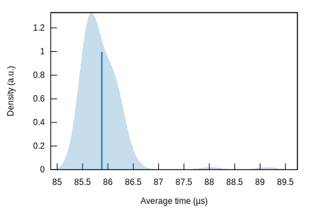
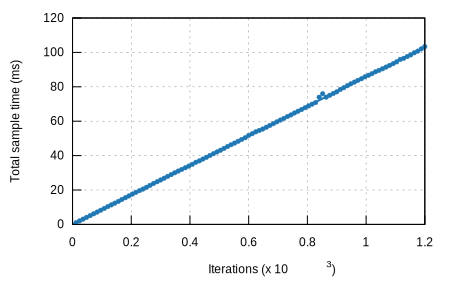

## k256-sign/libsecp256k1

#### Additional Statistics:

Lower boundEstimateUpper boundSlope85.775 µs85.886 µs86.030 µsR²0.99463660.99486030.9944789Mean85.799 µs85.881 µs85.979 µsStd. Dev.240.07 ns468.92 ns689.59 nsMedian85.680 µs85.712 µs85.889 µsMAD140.39 ns224.76 ns355.89 ns

#### Additional Plots:

- [Typical](typical.svg)
- [Mean](mean.svg)
- [Std. Dev.](SD.svg)
- [Median](median.svg)
- [MAD](MAD.svg)
- [Slope](slope.svg)

#### Understanding this report:

The plot on the left displays the average time per iteration for this benchmark. The shaded region
shows the estimated probability of an iteration taking a certain amount of time, while the line
shows the mean. Click on the plot for a larger view showing the outliers.

The plot on the right shows the linear regression calculated from the measurements. Each point
represents a sample, though here it shows the total time for the sample rather than time per
iteration. The line is the line of best fit for these measurements.

See [the\
documentation](https://bheisler.github.io/criterion.rs/book/user_guide/command_line_output.md#additional-statistics) for more details on the additional statistics.

This report was generated by
[Criterion.rs](https://github.com/bheisler/criterion.rs), a statistics-driven benchmarking
library in Rust.

