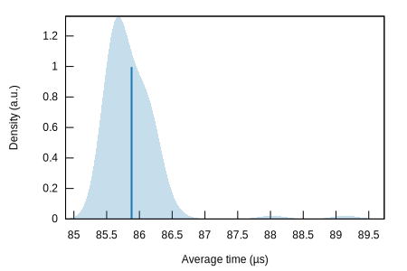
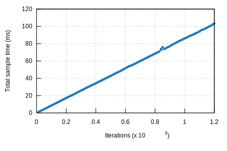
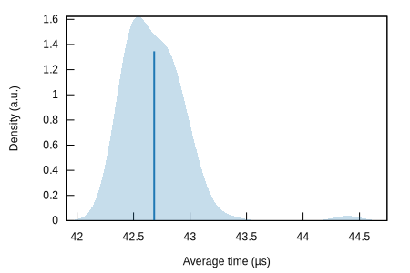
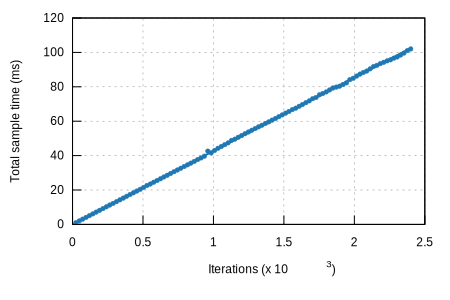

## k256-sign

### Violin Plot

This chart shows the relationship between function/parameter and iteration time. The thickness of the shaded
region indicates the probability that a measurement of the given function/parameter would take a particular
length of time.

[**k256-sign/libsecp256k1**](../../k256-sign/libsecp256k1/report/index.md)[**k256-sign/rust-crypto**](../../k256-sign/rust-crypto/report/index.md)[**k256-sign/secp256k1**](../../k256-sign/secp256k1/report/index.md)

This report was generated by
[Criterion.rs](https://github.com/bheisler/criterion.rs), a statistics-driven benchmarking
library in Rust.

