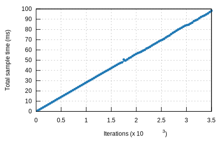

## k256-verify

### Violin Plot

This chart shows the relationship between function/parameter and iteration time. The thickness of the shaded
region indicates the probability that a measurement of the given function/parameter would take a particular
length of time.

[**k256-verify/libsecp256k1**](../../k256-verify/libsecp256k1/report/index.md)[**k256-verify/rust-crypto**](../../k256-verify/rust-crypto/report/index.md)[**k256-verify/rust-crypto (rec)**](../../k256-verify/rust-crypto (rec)/report/index.md)[/report/pdf_small.svg)](../../k256-verify/rust-crypto (rec)/report/pdf.svg)[/report/regression_small.svg)](../../k256-verify/rust-crypto (rec)/report/regression.svg)[**k256-verify/secp256k1**](../../k256-verify/secp256k1/report/index.md)[**k256-verify/secp256k1 (rec)**](../../k256-verify/secp256k1 (rec)/report/index.md)[/report/pdf_small.svg)](../../k256-verify/secp256k1 (rec)/report/pdf.svg)[/report/regression_small.svg)](../../k256-verify/secp256k1 (rec)/report/regression.svg)

This report was generated by
[Criterion.rs](https://github.com/bheisler/criterion.rs), a statistics-driven benchmarking
library in Rust.

