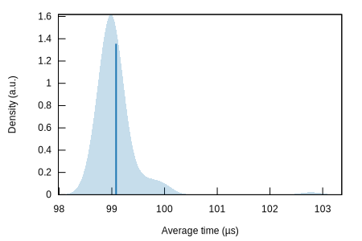
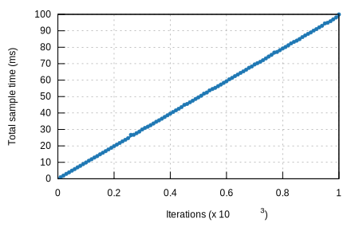

## prove/schnorrkel

#### Additional Statistics:

Lower boundEstimateUpper boundSlope98.998 µs99.064 µs99.142 µsR²0.99868030.99874010.9986585Mean99.003 µs99.081 µs99.179 µsStd. Dev.221.33 ns461.61 ns702.82 nsMedian98.979 µs99.009 µs99.042 µsMAD100.00 ns143.24 ns228.43 ns

#### Additional Plots:

- [Typical](typical.svg)
- [Mean](mean.svg)
- [Std. Dev.](SD.svg)
- [Median](median.svg)
- [MAD](MAD.svg)
- [Slope](slope.svg)

#### Understanding this report:

The plot on the left displays the average time per iteration for this benchmark. The shaded region
shows the estimated probability of an iteration taking a certain amount of time, while the line
shows the mean. Click on the plot for a larger view showing the outliers.

The plot on the right shows the linear regression calculated from the measurements. Each point
represents a sample, though here it shows the total time for the sample rather than time per
iteration. The line is the line of best fit for these measurements.

See [the\
documentation](https://bheisler.github.io/criterion.rs/book/user_guide/command_line_output.md#additional-statistics) for more details on the additional statistics.

This report was generated by
[Criterion.rs](https://github.com/bheisler/criterion.rs), a statistics-driven benchmarking
library in Rust.

