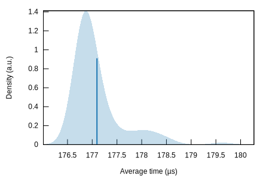
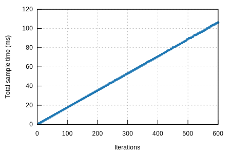

## prove/ark\_ec\_vrf\_ed25519 ( [History](history.md))

#### Additional Statistics:

Lower boundEstimateUpper boundSlope177.01 µs177.12 µs177.23 µsR²0.99922220.99926950.9992148Mean177.00 µs177.10 µs177.20 µsStd. Dev.361.90 ns507.51 ns643.20 nsMedian176.86 µs176.89 µs176.94 µsMAD106.92 ns190.13 ns248.05 ns

#### Additional Plots:

- [Typical](typical.svg)
- [Mean](mean.svg)
- [Std. Dev.](SD.svg)
- [Median](median.svg)
- [MAD](MAD.svg)
- [Slope](slope.svg)

#### Understanding this report:

The plot on the left displays the average time per iteration for this benchmark. The shaded region
shows the estimated probabilty of an iteration taking a certain amount of time, while the line
shows the mean. Click on the plot for a larger view showing the outliers.

The plot on the right shows the linear regression calculated from the measurements. Each point
represents a sample, though here it shows the total time for the sample rather than time per
iteration. The line is the line of best fit for these measurements.

See [the\
documentation](https://bheisler.github.io/criterion.rs/book/user_guide/command_line_output.md#additional-statistics) for more details on the additional statistics.

This report was generated by [cargo-criterion](https://github.com/bheisler/cargo-criterion)

