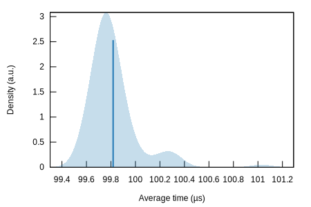
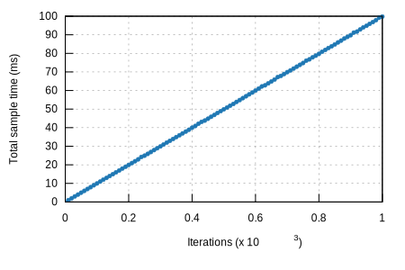
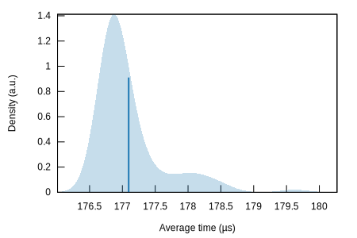

## prove

### Violin Plot

This chart shows the relationship between function/parameter and iteration time. The thickness of the shaded
region indicates the probability that a measurement of the given function/parameter would take a particular
length of time.

[**prove/schnorrkel**](../prove/schnorrkel/index.md)[**prove/ark\_ec\_vrf\_ed25519**](../prove/ark_ec_vrf_ed25519/index.md)

This report was generated by [cargo-criterion](https://github.com/bheisler/cargo-criterion)

