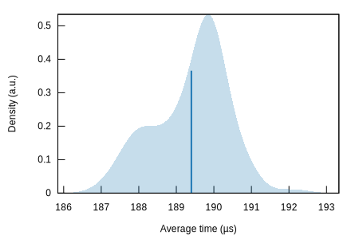
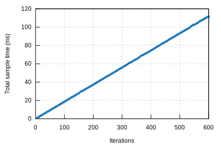
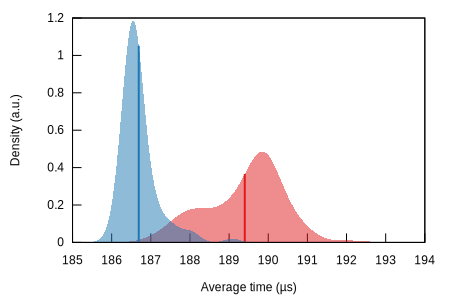
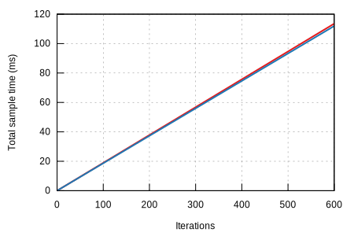

## prove/ark-ec-vrf-bandersnatch-sha512-ed

#### Additional Statistics:

Lower boundEstimateUpper boundSlope186.50 µs186.60 µs186.70 µsR²0.99934420.99937990.9993368Mean186.61 µs186.69 µs186.79 µsStd. Dev.329.79 ns466.17 ns596.12 nsMedian186.53 µs186.59 µs186.67 µsMAD194.84 ns244.42 ns324.25 ns

#### Additional Plots:

- [Typical](typical.svg)
- [Mean](mean.svg)
- [Std. Dev.](SD.svg)
- [Median](median.svg)
- [MAD](MAD.svg)
- [Slope](slope.svg)

#### Understanding this report:

The plot on the left displays the average time per iteration for this benchmark. The shaded region
shows the estimated probability of an iteration taking a certain amount of time, while the line
shows the mean. Click on the plot for a larger view showing the outliers.

The plot on the right shows the linear regression calculated from the measurements. Each point
represents a sample, though here it shows the total time for the sample rather than time per
iteration. The line is the line of best fit for these measurements.

See [the\
documentation](https://bheisler.github.io/criterion.rs/book/user_guide/command_line_output.md#additional-statistics) for more details on the additional statistics.

### Change Since Previous Benchmark

#### Additional Statistics:

Lower boundEstimateUpper boundChange in time-1.5357%-1.4302%-1.3184%(p = 0.00 <
0.05)
Performance has improved.

#### Additional Plots:

- [Change in mean](change/mean.svg)
- [Change in median](change/median.svg)
- [T-Test](change/t-test.svg)

#### Understanding this report:

The plot on the left shows the probability of the function taking a certain amount of time. The red
curve represents the saved measurements from the last time this benchmark was run, while the blue curve
shows the measurements from this run. The lines represent the mean time per iteration. Click on the
plot for a larger view.

The plot on the right shows the two regressions. Again, the red line represents the previous measurement
while the blue line shows the current measurement.

See [the\
documentation](https://bheisler.github.io/criterion.rs/book/user_guide/command_line_output.md#change) for more details on the additional statistics.

This report was generated by
[Criterion.rs](https://github.com/bheisler/criterion.rs), a statistics-driven benchmarking
library in Rust.

