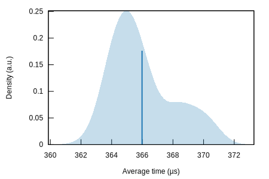
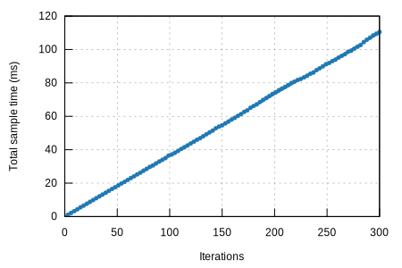

## prove

### Violin Plot

This chart shows the relationship between function/parameter and iteration time. The thickness of the shaded
region indicates the probability that a measurement of the given function/parameter would take a particular
length of time.

[**prove/ark-ec-vrf-bandersnatch-blake2-ed**](../../prove/ark-ec-vrf-bandersnatch-blake2-ed/report/index.md)[**prove/ark-ec-vrf-bandersnatch-sha512-ed**](../../prove/ark-ec-vrf-bandersnatch-sha512-ed/report/index.md)[**prove/ark-ec-vrf-bandersnatch-sha512-ws**](../../prove/ark-ec-vrf-bandersnatch-sha512-ws/report/index.md)[**prove/ark\_ec\_vrf\_ed25519**](../../prove/ark_ec_vrf_ed25519/report/index.md)[**prove/bandersnatch-vrfs**](../../prove/bandersnatch-vrfs/report/index.md)[**prove/schnorrkel**](../../prove/schnorrkel/report/index.md)

This report was generated by
[Criterion.rs](https://github.com/bheisler/criterion.rs), a statistics-driven benchmarking
library in Rust.

