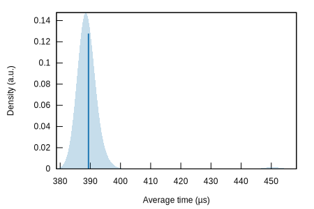
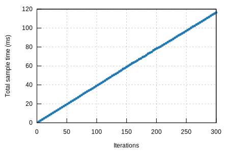

## verify/ark-ec-vrf\_bandersnatch-sha512-ed

#### Additional Statistics:

Lower boundEstimateUpper boundSlope388.97 µs389.34 µs389.79 µsR²0.99673090.99685590.9966728Mean389.85 µs390.21 µs390.57 µsStd. Dev.1.6132 µs1.8616 µs2.0786 µsMedian389.54 µs389.76 µs390.15 µsMAD1.4198 µs2.0088 µs2.5102 µs

#### Additional Plots:

- [Typical](typical.svg)
- [Mean](mean.svg)
- [Std. Dev.](SD.svg)
- [Median](median.svg)
- [MAD](MAD.svg)
- [Slope](slope.svg)

#### Understanding this report:

The plot on the left displays the average time per iteration for this benchmark. The shaded region
shows the estimated probability of an iteration taking a certain amount of time, while the line
shows the mean. Click on the plot for a larger view showing the outliers.

The plot on the right shows the linear regression calculated from the measurements. Each point
represents a sample, though here it shows the total time for the sample rather than time per
iteration. The line is the line of best fit for these measurements.

See [the\
documentation](https://bheisler.github.io/criterion.rs/book/user_guide/command_line_output.md#additional-statistics) for more details on the additional statistics.

This report was generated by
[Criterion.rs](https://github.com/bheisler/criterion.rs), a statistics-driven benchmarking
library in Rust.

